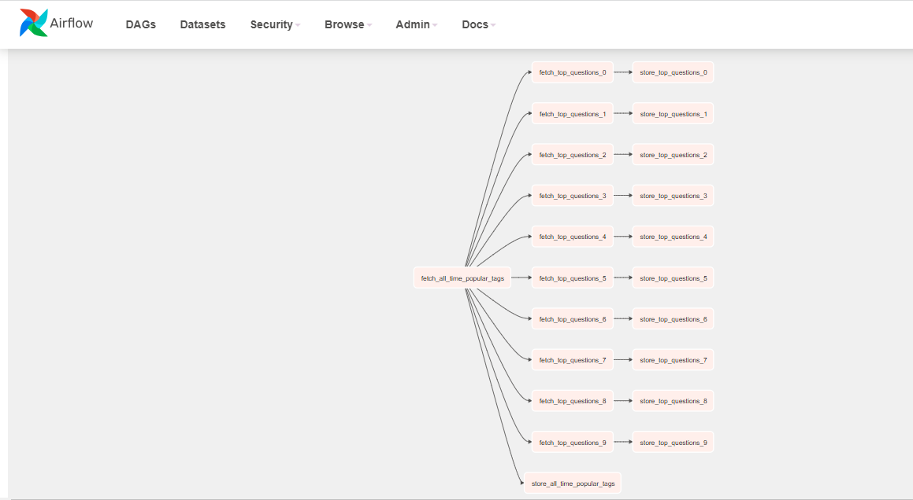
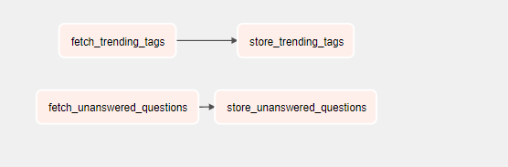
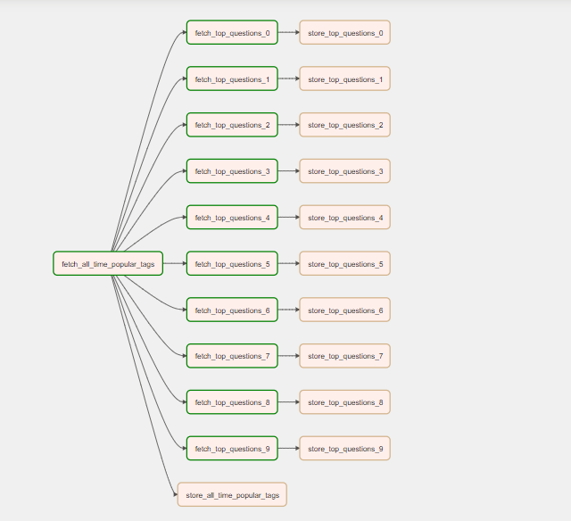
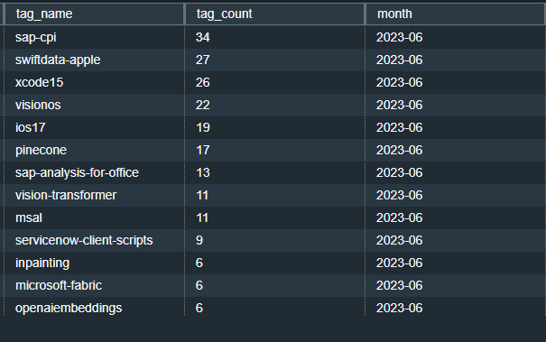
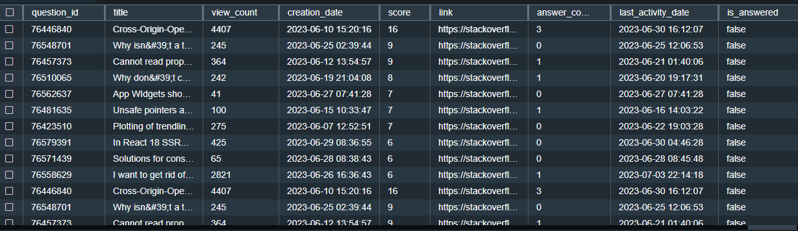

# StackOverflow-Packt_Task
Based on the API design and implement a process/processes to fetch data from the API such that it can answer important business queries that can contribute into the market research for a developer publishing company.
# Business Queries
* trending tags in last 30 days.
* top 10 all-time popular tags and their top 10 questions in last 30 days.
* top 10 questions unanswered.

# Snapshots of DAG run and Tables populated in redshift

